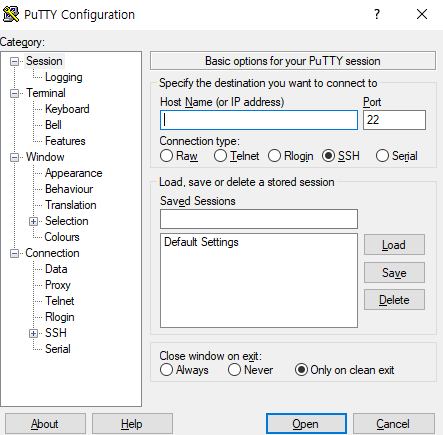
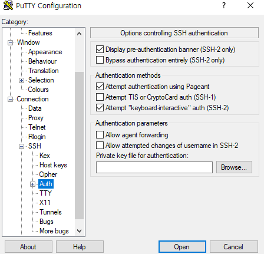
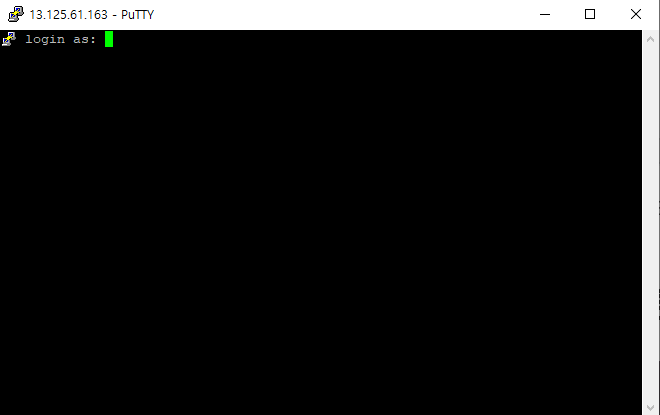
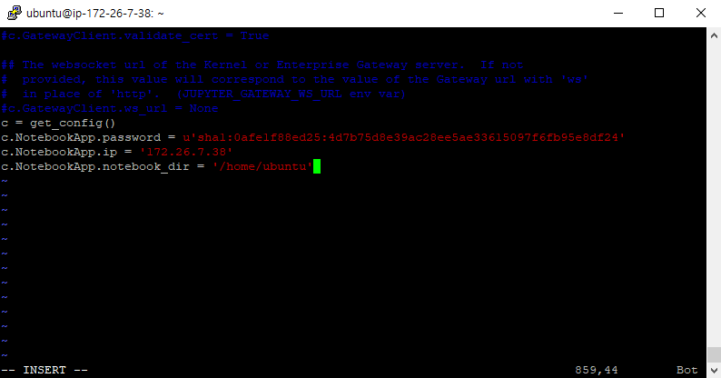
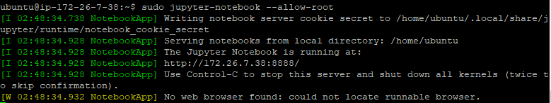

# AWS 초기 셋팅

## IP address & key pair file로 AWS 접속하기(PuTTY)

1. https://www.putty.or 에서 putty 설치
2. PuTTYgen으로 private key 만들기


   - `Load` 버튼을 눌러 key pair file을 선택한 뒤, `Save private key` 버튼을 눌러 private key 생성

3. PuTTY로 AWS 인스턴스 접속하기



   - `Host Name`에 private IP address를 입력



   - Connection > SSH > Auth에서 `Private key for authentication`에 2번에서 만든 private key를 가져오기

4. `open`버튼을 눌러 접속



   - `ubuntu`를 입력하고 로그인

## 주피터 노트북 설치 및 사용

1. 주피터 노트북 설치

   - `apt`란 advanced packaging tool로 Ubuntu를 포함한 Debian 계열의 리눅스에서 쓰이는 패키지 관리 툴

```shell
sudo apt-get update
sudo apt-get install python3-pip
sudi pip3 install notebook
```

2. 주피터 노트북 비밀번호 설정

    - passwd 설정한 뒤 SHA1 값 기록하기

```python
python3
>>> from notebook.auth import passwd
>>> passwd()
```

3. 주피터 환경 설정

```shell
ifconfig # 현재 서버 내부망 IP 주소 확인
jupyter notebook --generate-config # config 파일 위치 확인 
sudo vi /home/ubuntu/.jupyter/jupyter_notebook_config.py
# sudo vi [config.py 위치]
```

- jupyter_notebook_config.py열어서 파일 가장 아래 쪽에 다음 내용을 추가

```python
c = get_config()
c.NotebookApp.password = u'sha1:{해시 값}'
c.NotebookApp.ip = '{내부 IP}'
c.NotebookApp.notebook_dir = '{시작 디렉토리}'
# 내부 IP로는 SSH로 접속했을 때 콘솔 창에 나오는 아이피를 입력
```



4. 주피터 노트북 실행

```shell
sudo jupyter-notebook --allow-root
```



   - 8888 포트번호로 열린 것을 확인
   - `private IP/8888` 로 접속

5. 주피터 노트북 항상 켜놓기

```shell
sudo jupyter-notebook --allow-root
ctrl+Z # 실행 종료
bg
disown -h
```

_여기까지 PuTTY로 AWS EC2 인스턴스에 접속해서 주피터 노트북을 설치했습니다._

## EC2 인스턴스에 프로젝트 초기 설정

git clone 한 뒤, 프로젝트 설정

1. `yarn install`

   - Ubuntu에 yarn이 설치되어 있지 않아 설치해야 됩니다.

- 기존 yarn, cmdtest 지우기

```shell
~$ sudo apt remove cmdtest
~$ sudo apt remove yarn
```

- 저장소 등록

```shell
~@halink:~# curl -sS https://dl.yarnpkg.com/debian/pubkey.gpg | apt-key add -
OK
```

```shell
~@halink:~# echo "deb http://dl.yarnpkg.com/debian/ stable main" | sudo tee /etc/apt/sources.list.d/yarn.list
deb http://dl.yarnpkg.com/debian/ stable main
```

- apt-get update

```shell
apt-get update
```

- 설치

```shell
~@halink:~# apt-get install yarn
~@halink:~# yarn --version
0.32
```

참고 : https://zetawiki.com/wiki/%EC%9A%B0%EB%B6%84%ED%88%AC_yarn_%EC%84%A4%EC%B9%98

2. vue/cli 설치

```shell
~# npm install @vue/cli
```

3. 가상 환경 설정

```shell
$ python -m venv .venv
$ source .venv/bin/activate
```

**Ubuntu는 Window와 다르게 Scripts 디렉토리가 없고 bin 디렉토리에 activate 파일이 있습니다.**

4. django package 설치

```shell
$ pip install -r requirements.txt
$ python manage.py migrate
```

**requirements.txt 목록을 설치하는데 error 발생**

`pg_config executable not found ubuntu`

위와 같은 error가 발생 시, 아래와 같이 설치 후 다시 requirements 목록을 설치해줍니다.

```shell
$ sudo apt-get install libpq-dev python-dev
```

참고 : https://stackoverflow.com/questions/11618898/pg-config-executable-not-found

4. server 테스트

```shell
$ python manage.py runserver 0.0.0.0:8000
```

**0.0.0.0을 써주지 않으면 접속 IP가 127.0.0.1(localhost)로 되기 때문에 접속 할 수가 없습니다.**

위와 다른 방법으로 해결한 블로그 주소입니다.
참고 : https://velog.io/@ground4ekd/AWS-EC2


**만약 run server가 되지 않는다면, `node_modules`, `package-lock.json`을 지우고 yarn을 다시 설치한뒤, vue/cli도 설치해주세요**