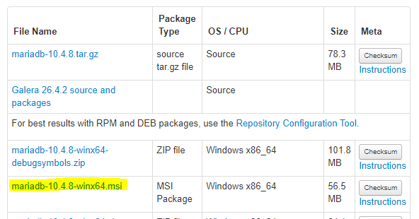
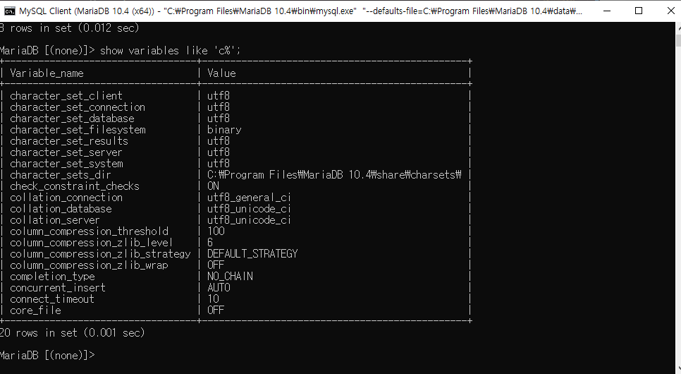
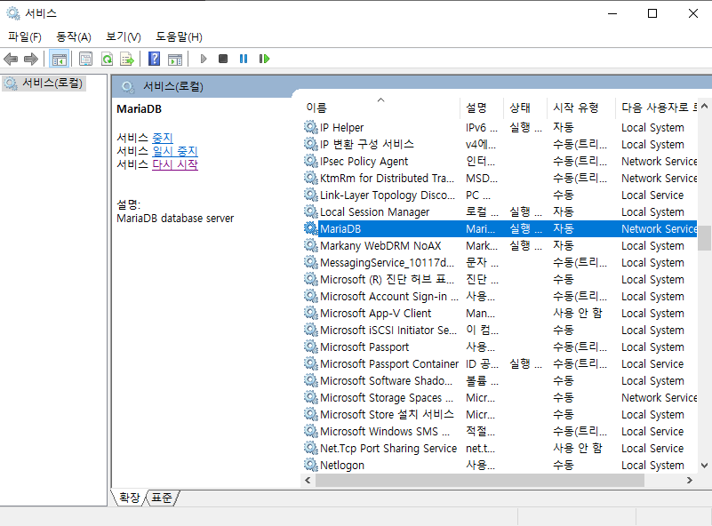

# Django & Maria DB 연결

## Maria DB 설치

- 아래 URL에 접속해서 설치하기
https://downloads.mariadb.org/mariadb/10.4.8/



```text
password : root
```

## DB 생성

1. MySQL Client를 실행
2. 설치때 설정한 passwd를 입력 (passwd : root)
3. DB 생성

```sql
show databases; # 현재 데이터 베이스 확인

create database hylink; # hylink DB 생성

use hylink; # hylink 활성화
```

## Python Maria DB 설치

```python
pip install mysqlclient
```

## django DB setting

- setting.py 수정 (hylink에서는 `settings/dev.py`)

```python
DATABASES = {

    'default': {
        #'ENGINE': 'django.db.backends.sqlite3',
        #'NAME': os.path.join(BASE_DIR, 'db.sqlite3'),

        'ENGINE': 'django.db.backends.mysql',
        'NAME': 'db-name',  # hylink
        'USER': 'db-user-name', # root
        'PASSWORD': 'db-password', # root
        'HOST': 'db-adress', #공백으로 냅두면 default localhost
        'PORT': 'port-number' #공백으로 냅두면 default 3306
    }
}
```

## DB migrate

- **app별로 migrations&migrate를 해줘야 한다**

```python
python manage.py makemigrations <appname>
python manage.py migrate <appname>
```

- `appname`을 붙여서 app별로 migrate를 해준 뒤, 전체적으로 migrate를 한번 더 해준다.

```python
python manage.py migrate
```

_app 별로 migrate를 해주고 전체적으로 해야 error가 발생하지 않습니다._

## DB utf-8 설정

1. 현재 DB charater set 설정을 확인합니다.

```sql
show variables like 'c%';
```



_예시처럼 utf-8로 나와야합니다._

2. 현재 `hylink` 스키마에 있는 테이블을 모두 삭제합니다.

- 테이블 삭제는 HeidiSQL 프로그램을 사용해서 GUI 상 삭제합니다.

3. `hylink/backend/settings/dev.py`에 OPTIONS 내용 추가

```python
DATABASES = {
    'default' : {
        'ENGINE': 'django.db.backends.mysql',
        'NAME': 'hylink',
        'USER' : 'root',
        'PASSWORD' : 'root',
        'HOST' : 'localhost',
        'PORT' : '',
        'OPTIONS': {
            'charset': 'utf8mb4'
        }
    }
}
```

4. MariaDB 환경 변수 설정

`C:\Program Files\MariaDB 10.4\data\my.ini` 파일에 내용 추가

```text
...
[mysqld]
....
#Add
collation-server = utf8_unicode_ci
init-connect='SET NAMES utf8'
character-set-server = utf8

...

[client]
port=3306
...
#Add
default-character-set = utf8

[mysqldump]
...
#Add
default-character-set = utf8

[mysql]
...
#Add
default-character-set = utf8
```

_없는 부분을 추가하면 됩니다._

5. 서비스 재시작을 해야 됩니다.

- 윈도우에 서비스를 검색해서 실행합니다.



MariaDB를 찾아 더블 클릭후, 서비스 중지 후 다시 시작합니다.
